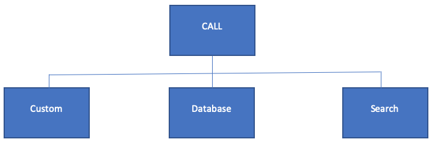

Tripal WS BrAPI Call Types
==========================

Tripal Web Service BrAPI Call Types: This module structures call into 3 types
namely, **Custom call**, **Database call** and **Search call**.

.. list-table::
   :widths: 50 50
   :header-rows: 1

   * - **Custom Call**
     - Data source can be supplied by user either by typing a list or by defining
       an array of values. No database table involve.
   * - **Database Call**
     - Data source comes from a Chado Table and can be configured to restrict result
       based on the type_id column or value column of the corresponding prop (property) table.
   * - **Search Call**
     - Similar to Database call, search call operates like a database call except
       each request undergoes a two-stage process. First it will post a request that
       will result in a unique id number then the second stage, using the id number
       returned will produce the response. A log keeps a record of requests made
       (see Manage Search Request Log).

This modules has built-in calls namely v1/calls, v1/germplasm, v1/crops, v1/commoncropnames
and search call v1/search/germplasm, alternatively, all of this call can be viewed as
BrAPI call response by requesting v1/calls call.

.. note:: Host/web-services/brapi/v1/call or host/web-services/brapi/v2/serverinfo

Apart from these predefined calls mentioned, an external module (hosted by the
same Drupal website) can implement a call or override a call without necessarily
storing call assets in the same directory as this module, which will enable
developers to extend functionality.
