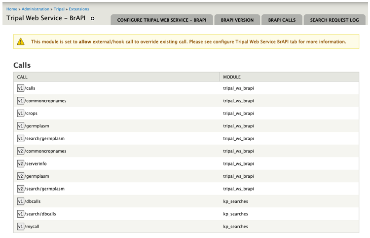

Configuration
=============

**TRIPAL_WS_BRAPI** module generates a number of system variables that will give end
users technical control over its general operation and call request response mechanism.
Upon installation of this module, the following table summarizes all system variables
created and the default value each one is set to.

.. code-block:: php

   FILE: tripal_ws_brapi/includes/config.inc

Summary table showing system variables:
---------------------------------------

.. list-table::
   :widths: 25 50 25
   :header-rows: 1

   * - Configuration
     - Use
     - Default Value
   * - **$config_ws_brapi**
     - Holds the name of the module. To prevent variable name conflict with other
       modules, all system variables are prefixed with the module name.
     - Do not change
   * - **$config_version**
     - The default BrAPI version of this implementation.
     - 1.3
   * - **$config_resultset_limit**
     - Limit the number of items/data per page returned by a BrAPI call request
     - 100 items per page
   * - **$config_supported_method**
     - REST request methods supported.
     - GET and POST
   * - **$cofig_menu_level**
     - An arbitrary levels may be added to request URL as outlined in BrAPI URL
       structure specifications. See `BrAPI URL Structure <https://brapi.docs.apiary.io>`_
     - web-services
   * - **$config_hook**
     - External modules can implement a new call or override existing call through
       the use of Drupal hooks. The string value of this configuration is used to
       signal this module that a module is implementing calls.
     - tripal_ws_brapi_call
   * - **$config_allow_override_hook**
     - In cases where an external module implements a call that is identical in
       name and version to an existing call, this option will decide which of the
       two call instances to apply.
     - no – use the local version of the call.

All configuration variables can be modified as desired, except for the module name.
Be sure to save your changes before installing the module. Alternatively, most of
these system variables can be altered using the configuration page after the
installation routine.

*Figure 1 – Module configuration page showing all active BrAPI calls and the
module each call is hosted. Series of page tabs show sections of this module that
can be configured.*

Configuration page allows system administrator to set different values to system
variables outlined above. In addition, all active BrAPI calls or simply calls,
as well as, search request call logs are summarized in this interface.
This page can be accessed using:

A. Drupal administration context menu /Tripal/Extensions/Tripal Web Service – BrAPI
***********************************************************************************

Alternatively, copy and paste this URL into the browser’s location bar.

B . host/ admin/tripal/extension/tripalwsbrapi/configure
***********************************************************************************

Sections are laid out in page tabs and are labelled to indicate which are of this
module it covers. Each tab as seen in Figure 1, moving from left to right is
summarized in the table below.

.. list-table::
   :widths: 50 50
   :header-rows: 0

   * - **CONFIGURE TRIPAL WEB SERVICE BRAPI**
     - Configure overall module operation such as menu levels, HTTP request
       methods to support and call override strategy.
   * - **BRAPI VERSION**
     - Add BrAPI version(s) to support.
   * - **BRAPI CALLS**
     - Configure call restrictions or filter conditions used by each call when
       performing queries.
   * - **SEARCH REQUEST LOG**
     - A summary of all search request made. See
       `BrAPI Search Services <https://brapi.docs.apiary.io/#introduction/search-services>`_
