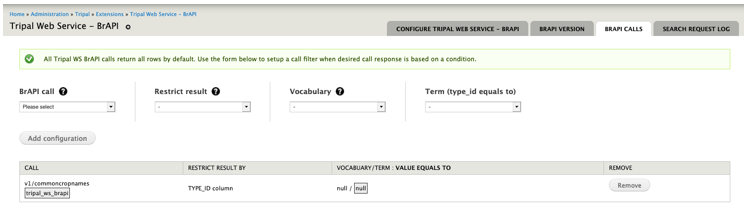

Configure Tripal Web Service BrAPI Calls
========================================

*Figure 4 – Configuration page showing call settings.*

Every call setup (see setting up calls) that performs a query to a CHADO database
table can be configured using this form. This page enables system administrators
to create additional restriction or filter criteria based on values stored in
columns *CHADO.table – type_id column* and *CHADO.property table*.
Each select field contains a summarized values from either of the table columns
for quick and easy selections. A summary table below this form outlines all
restrictions to a call as shown in Figure 4.

A row in the summary table can be interpreted as (from left to right column)

.. note:: Call, version X, hosted by Y module, titled ABC, restricts its results
   by type_id/value column, where its type_id value is of type W cv, equals to H cvterm.

**To setup a database query filter/restriction to a call.**

1.	Select a BrAPI call from the select box.

.. note:: When a call does not involve querying of data from a database table,
   such as a custom call, a warning message will pop up instructing user that
   call cannot implement a query condition.

2.	Each call can either use the column type_id or a property table. Restrict
    select field will analyze data stored and decide if it could support either
    option. Select an available option.
3.	Once a restrict option has been selected, subsequent fields will auto-populate
    with relevant values, once again based on values or records stored.
4.	Select option when prompted.

.. note:: Another field labelled Value will present when restrict is set to property table.

5.	Click Add configuration button to save.
6.	When additional term is required, re-select the same call title. All select
    field elements will auto-fill with values that have been previously selected
    for easy and quick selection. Select additional values.
7.	All configurations will be summarized in the summary table.

.. note:: Implement the call restriction created when setting up the call.
   See Setup Tripal WS Call.
