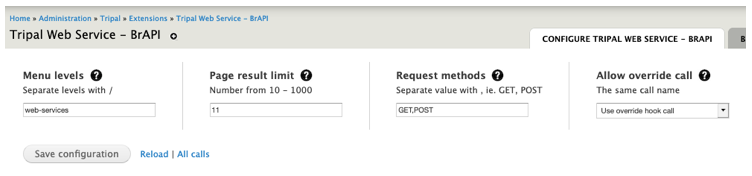

Configure Tripal Web Service BrAPI Module
=========================================

*Figure 2 – Configuration page showing module settings.*

Most system variables described can be accessed and modified using this form.
Each field item (in all sections) can be described with a help or information
text by hovering the mouse pointer on to help (question mark) icons.
Click Save configuration button to save changes each time an option is modified.

.. note:: Clear cache each time when setting menu levels options.

.. list-table::
   :widths: 25 50 25
   :header-rows: 1

   * - Configuration
     - Use
     - Default Value
   * - **Menu Levels**
     - An arbitrary levels may be added to request URL as outlined in BrAPI URL
       structure specifications. See `BrAPI URL Structure <https://brapi.docs.apiary.io>`_
     - web-services
   * - **Page result limit**
     - Limit the number of items/data per page returned by a BrAPI call request
     - 100 items per page
   * - **Request methods**
     - REST request methods supported.
     - GET and POST
   * - **Allow override call**
     - In cases where an external module implements a call that is identical in
       name and version to an existing call, this option will decide which of the
       two call instances to apply.
     - no – use the local version of the call.
