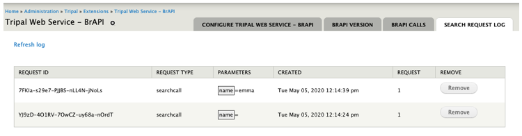

Configure Tripal Web Service BrAPI Search Calls Request Log
===========================================================

*Figure 5 –  Configuration page showing search request log.*

As described by BrAPI search services
(`https://brapi.docs.apiary.io/#introduction/search-services <https://brapi.docs.apiary.io/#introduction/search-services>`_),
all search call request using POST request method will be saved. This page summarizes
all search call history, along with every call details, parameters, date created and
number of times it has been requested. A Remove button is available to erase a
log item permanently.
