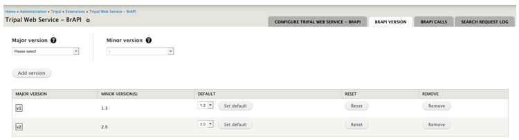

Configure Tripal Web Service BrAPI Version
==========================================

*Figure 3 – Configuration page showing BrAPI version settings.*

Most system variables described can be accessed and modified using this form.
Each field item (in all sections) can be described with a help or information
text by hovering the mouse pointer on to help (question mark) icons. Click Save
configuration button to save changes each time an option is modified.

.. warning:: A version unsupported error message will be returned when attempting
to request a call with undefined or not configured version number.

To support multiple versions of BrAPI in a single implementation, this page enables
system administrators to plan and set additional version numbers. BrAPI only
requires the major version number (leftmost digit also seen in request url – brapi/v1/..)
when requesting a call, while calls can be versions 1.2 and/or 1.3 etc.

**This version construct can be arranged using this page.**

1.	Select major version number from the list in Major version select field.
2.	Select minor version number from the list in Minor version select field.
3.	Click Add version button to save.
4.	Each version added will be sorted and grouped according to major version
    number shown in the summary table below the form.
5.	To add more version to a major version, re-select the major version number
    and select a minor version number then click Add version button. Minor
    version select field keeps track of what has been added, thus making sure
    no the same minor version number can be added more than once.
6.	Additional version will be sorted accordingly as they are added to the group.
7.	With multiple version, select a default, among the list of minor versions,
    to set as the default version of a major version number.
8.	Use Reset button to drop all other versions except the default already set.
9.	To remove version (including minor versions and default), click Remove button.

.. warning:: This module can only default to a single version at a given time per
major version ie BrAPI 1.3. Other version such as BrAPI 1.2 can be implemented
along side BrAPI 1.3, but requires switching from either versions as desired.
