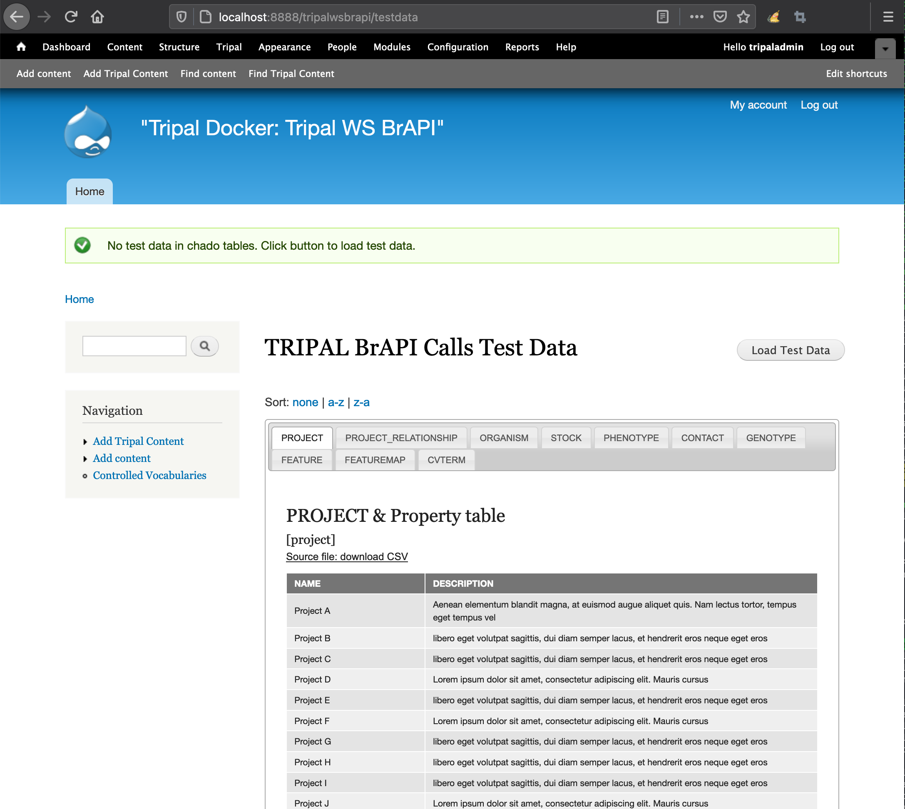
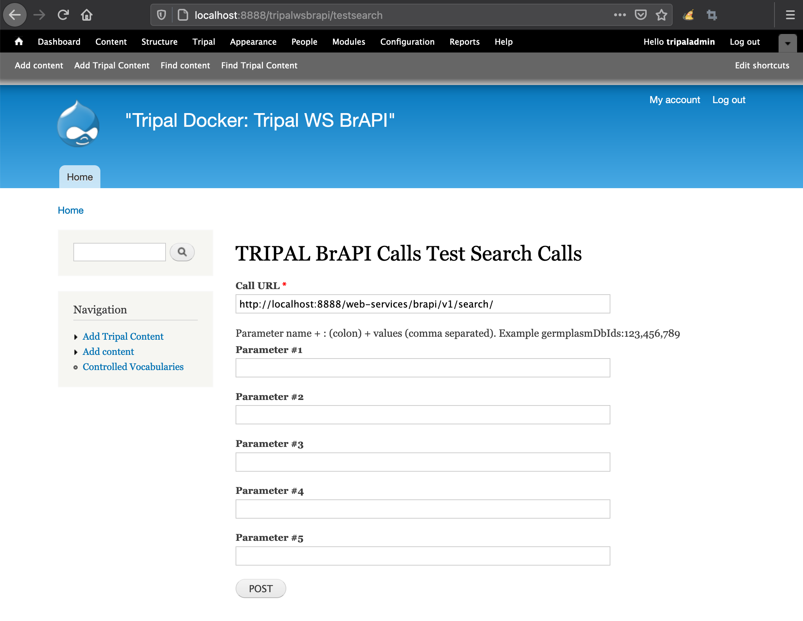

Contributing
==============

We’re excited to work with you! Post in the issues queue with any questions, feature requests, or proposals.

Quickly setting up a Testing/Demo Environment using Docker
------------------------------------------------------------

The following commands clone this repository and then start a Drupal7Docker container with the the current directory mounted. It also initializes the Tripal site by starting postgresql, installing Tripal and Chado, and preparing the database.

.. code:: bash

  git clone https://github.com/UofS-Pulse-Binfo/tripal_ws_brapi.git
  cd tripal_ws_brapi
  docker pull laceysanderson/drupal7dev
  docker run --publish=8888:80 --name=tdocker -tid --env-file=tests/example.env --volume=`pwd`:/var/www/html/sites/all/modules/tripal_ws_brapi laceysanderson/drupal7dev:latest
  docker exec -it tdocker /app/init_scripts/startup_container.sh

Next we need to install this module and add test data to the site. The following commands achomplish this given the above setup.

.. code:: bash

  docker exec tdocker /var/www/html/vendor/bin/drush en tripal_ws_brapi tripal_ws_brapi_testdata -y
  docker exec --workdir=/var/www/html tdocker ./vendor/bin/drush php-script sites/all/modules/tripal_ws_brapi/tripal_ws_brapi_testdata/drush-scripts/loadTestData.php

Now you can proceed by running the automated tests:

.. code:: bash

  docker exec --workdir=/var/www/html/sites/all/modules/tripal_ws_brapi tdocker composer up
  docker exec --workdir=/var/www/html/sites/all/modules/tripal_ws_brapi tdocker vendor/bin/phpunit

Or manually testing it through http://localhost:8888/web-services.

Automated Testing
--------------------

This module uses `Tripal Test Suite <https://tripaltestsuite.readthedocs.io/en/latest/installation.html#joining-an-existing-project>`_. To run tests locally:

.. code:: bash

  cd MODULE_ROOT
  composer up
  ./vendor/bin/phpunit

This will run all tests associated with the Tripal WS BrAPI extension module. If you are running into issues, this is a good way to rule out a system incompatibility.

.. warning::

  It is highly suggested you ONLY RUN TESTS ON DEVELOPMENT SITES. We have done our best to ensure that our tests clean up after themselves; however, we do not guarantee there will be no changes to your database.

.. _demo-instructions:

Manual Testing (Demonstration)
--------------------------------

Using the Testing Helper Module
^^^^^^^^^^^^^^^^^^^^^^^^^^^^^^^^^

First enable the helper module through the UI or using Drush:

.. code::

  drush en tripal_ws_brapi_testdata

Then go to the provided user interface at https://[yourdrupalsite]/tripalwsbrapi/testdata

The tabbed table shows you all the test data which will be loaded into your site when you click the "Load Test Data" button.

You can edit the test data by editing the CSV files distributed with this helper module. More tables can be added by editing the array of chado table names in the tripal_ws_brapi_testdata.module file.

There is also an interface provided for testing POST calls. This is available at https://[yourdrupalsite]/tripalwsbrapi/testsearch

Using the Database Seeder
^^^^^^^^^^^^^^^^^^^^^^^^^^^

We have provided a `Tripal Test Suite Database Seeder <https://tripaltestsuite.readthedocs.io/en/latest/db-seeders.html>`_ to make development and demonstration of functionality easier. To populate your development database with fake germplasm data:

1. Install this module according to the instructions in this guide.
2. Run the database seeder to populate the database using the following commands:

  .. code::

    cd MODULE_ROOT
    composer up
    ./vendor/bin/tripaltest db:seed BrAPIDatabaseSeeder

4. To access the web services go to ``https:[your drupal site]/web-services`` assuming the default configuration.

.. warning::

  NEVER run database seeders on production sites. They will insert fictitious data into Chado.
