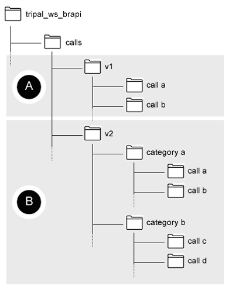
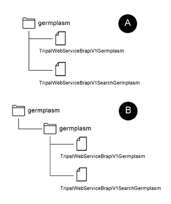

Setup Tripal WS BrAPI Call
==========================

A.  General information about calls: File structure
****************************************************

All calls (directory and files) must be saved in a calls/ directory of this module.
This file structure also applies to external modules implementing a set of calls.
TRIPAL_WS_BRAPI can support 2 file structures observed in BrAPI 1.3 and BrAPI 2.0,
illustrated in the folder diagram below, labelled as A and B, respectively.

*Figure 6 – Call directory structure supported. A: basic structure where calls
fall directly under version folder and B: where calls are grouped using a
category sub-folder.*

Every call directory contains 1 or 2 PHP .inc files:
**1. is a base call class file**
and
**2 search implementation class file.**

#2 file is optional when a call does not require search functionality.

See figure below showing an example of a call, v1/germplasm call using file
structure A or file structure B:

*Figure 7 – Call file structures showing both directory structure options.*

B. General information about calls: Naming file and class
*********************************************************

Call name or title should be the identical call title defined by BrAPI specification.
Directory name should match this title with all letters in lowercase form.
Filename must be in the following format:

**TripalWebService + V + Major Version Number + Call name or title with
  the first letter in capitalized form**

**For example:
  TripalWebServiceV1Germplasm.inc (to include the file extension which is .inc).**

A search implementation uses the same naming arrangement but has the keyword
Search inserted between the version number and the call title.

**For example:
  TripalWebServiceV1SearchGermplasm.inc (to include the file extension which is .inc).**

Both of these naming methods apply to when implementing a call that will be hosted
outside the module with the exception that each name must be prefixed with the
keyword **External**.

**For example:
  ExternalTripalWebServiceV1Germplasm.inc or ExternalTripalWebServiceV1SearchGermplasm.inc**

Class name will match the filename created using this method.

C. General information about calls: External module implementing a hook must implement hook using hook string (see configuration)
*********************************************************************************************************************************

To register an external module implementing a BrAPI call, use the hook string
configuration and implement the following hook in the .module file:

.. code-block:: php

   /**
    * Implement BrAPI calls.
    */
   function HOOK_tripal_ws_brapi_call() {
    // Indicate this module implements BrAPI calls.
    return TRUE;
   }

Where the HOOK is the module name and tripal_ws_brapi_call is the hook string
defined in the configuration. See Configuration.
